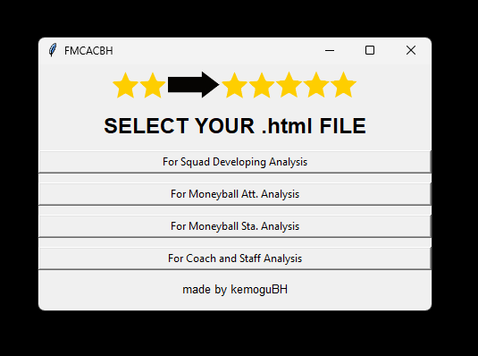
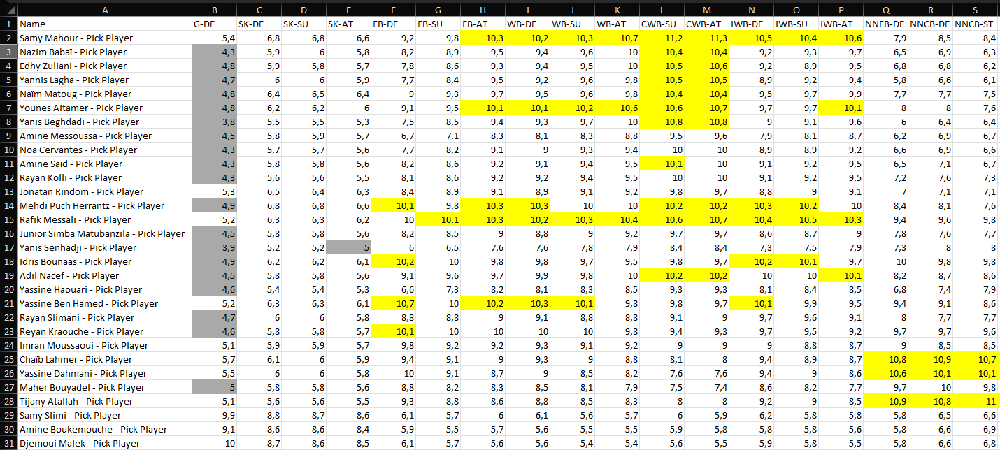
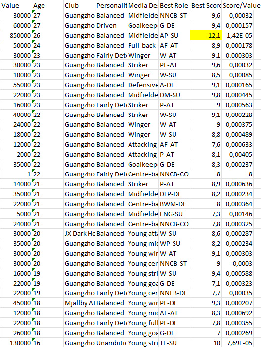

# Moneyball Mentality Application

# ENG
This desktop application aims to retrieve statistics from Football Manager game footballers and analyze them.

## Features

- Make evaluations according to the attributes of the players.
- Analyze players' performance data.
- Sorting and filtering options for players.
- Create statistics.
- Save and export data (Excel format).

## Installation 

- Download the setup file from the Releases section and unzip it.
- Run the setup file and install the program.
- Copy the files in the views folder to ...Documents/Sports Interactive/Football Manager 2024/views.
- Import the view files in the relevant areas of the game and take screenshots as web pages. (Note: The number of players should not exceed 100.)
- Then run the Moneyball Mentality program and select the area you want to see and upload your screenshot. Then save the created Excel file. That's it. You can now review.

# TR
Bu masaüstü uygulaması, Football Manager oyunu futbolcularından istatistik almayı ve bunları analiz etmeyi amaçlamaktadır.

## Özellikler

- Oyuncuların özelliklerine göre değerlendirmeler yapın.
- Oyuncuların performans verilerini analiz edin.
- Oyuncular için sıralama ve filtreleme seçenekleri.
- İstatistikler oluşturun.
- Verileri kaydedin ve dışa aktarın (Excel formatı).

## Kurulum

- Sürümler bölümünden kurulum dosyasını indirin ve zipten çıkarın.
- Kurulum dosyasını çalıştırın ve programı yükleyin.
- Görünümler klasöründeki dosyaları ...Documents/Sports Interactive/Football Manager 2024/views'e kopyalayın.
- Görünüm dosyalarını oyunun ilgili alanlarına aktarın ve ekran görüntülerini web sayfası olarak alın. (Not: Oyuncu sayısı 100'ü geçmemelidir.)
- Daha sonra Moneyball Mentality programını çalıştırıp görmek istediğiniz alanı seçin ve ekran görüntünüzü yükleyin. Daha sonra oluşturulan Excel dosyasını kaydedin. Bu kadar. Artık inceleyebilirsiniz.

## Screenshots / Ekran görüntüleri

Here are some screenshots from the application:

